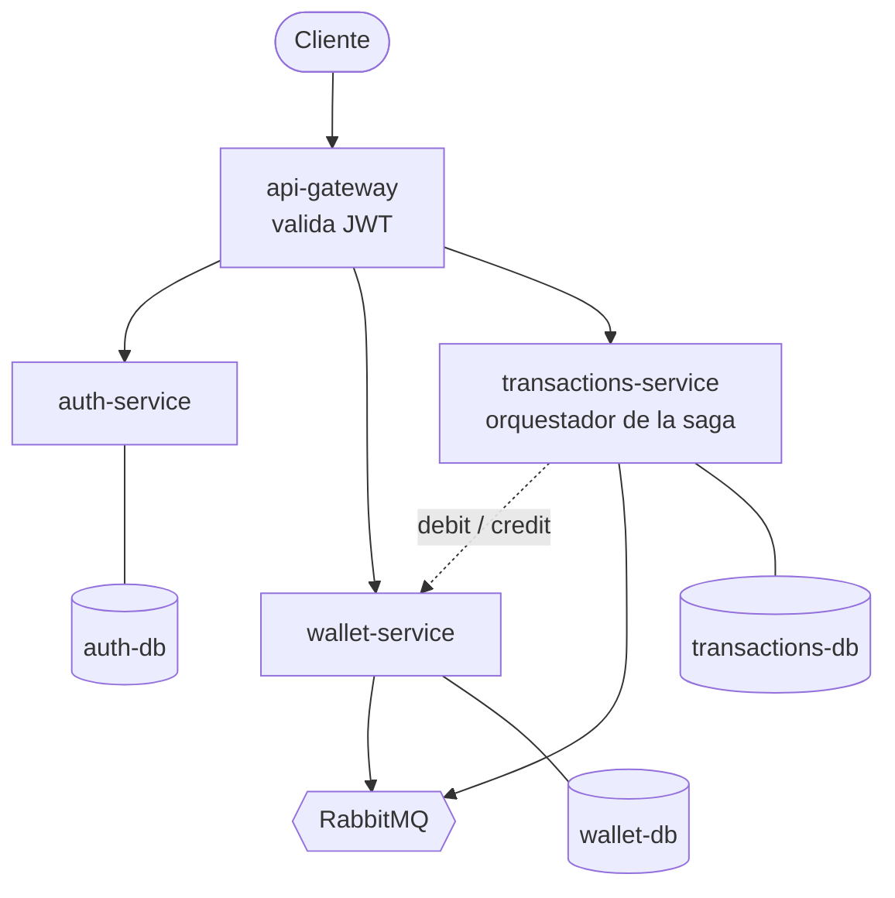
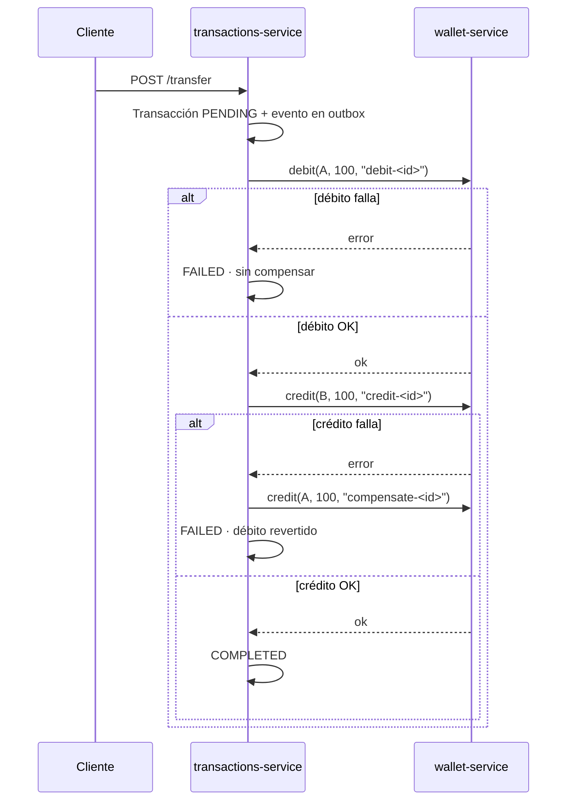

# Wallet System v2

Billetera digital distribuida en microservicios, construida para resolver bien un
problema concreto: **transferir dinero entre servicios que no comparten una
transacción de base de datos.**

El foco no es la funcionalidad de la billetera — es cómo se garantiza la
consistencia cuando el débito y el crédito viven en procesos distintos y
cualquiera de los dos puede fallar.

> **Estado:** en construcción. Ver [Roadmap](#roadmap) para lo que ya funciona.

## El problema

Transferir $100 de A a B requiere dos operaciones en servicios distintos:

```
wallet-service:  A.balance -= 100     ← puede fallar
wallet-service:  B.balance += 100     ← puede fallar
```

Sin una transacción distribuida, un fallo en el segundo paso deja el dinero
descontado de A y nunca acreditado en B. Este proyecto resuelve eso con el
**patrón Saga** con compensaciones, respaldado por **outbox transaccional** e
**idempotencia a nivel de base de datos**.

## Arquitectura



| Servicio | Responsabilidad | Puerto |
|---|---|---|
| `api-gateway` | Único punto de entrada. Valida JWT y rutea. | 3000 |
| `auth-service` | Registro, login, refresh tokens. | 3001 |
| `wallet-service` | Saldos. Débito y crédito idempotentes con lock. | 3002 |
| `transactions-service` | Orquesta la saga y sus compensaciones. | 3003 |

**Una base de datos por servicio.** Ningún servicio lee tablas de otro: si lo
hicieran, serían microservicios solo en el diagrama.

**Los servicios no se exponen al exterior.** Solo el gateway publica puerto. El
resto es alcanzable únicamente desde la red interna de Docker.

## El flujo de la saga



Cada paso lleva una clave de idempotencia **determinística**, derivada del ID de
la transacción. Un reintento genera la misma clave y la restricción `UNIQUE` de la
base de datos lo rechaza. La garantía vive en la base, no en el código.

Las decisiones detrás de este flujo están en [ADR-0003](./docs/adr/0003-saga-orquestada.md)
y [ADR-0004](./docs/adr/0004-outbox-e-idempotencia.md).

## Cómo levantarlo

```bash
cp .env.example .env     # completar los valores
docker compose up -d
```

## Stack

**NestJS** · **TypeScript** · **PostgreSQL** (una por servicio) · **RabbitMQ** ·
**Redis** · **TypeORM** · **Docker Compose** · monorepo con **pnpm workspaces**

Cada elección está documentada en [`docs/adr/`](./docs/adr/) con las alternativas
que se descartaron y por qué.

## Decisiones de diseño

| Decisión | ADR |
|---|---|
| Microservicios desde el inicio, aun sabiendo que un monolito sería más simple | [0001](./docs/adr/0001-microservicios-desde-el-inicio.md) |
| TypeORM sobre Prisma, por migraciones reversibles | [0002](./docs/adr/0002-typeorm-sobre-prisma.md) |
| Saga orquestada, no coreografiada | [0003](./docs/adr/0003-saga-orquestada.md) |
| Outbox transaccional e idempotencia por `UNIQUE` | [0004](./docs/adr/0004-outbox-e-idempotencia.md) |

## Roadmap

- [x] Estructura del monorepo, CI y documentación base
- [ ] `packages/contracts` — eventos y tipos compartidos
- [ ] `auth-service` — registro, login, JWT
- [ ] `wallet-service` — saldos con débito/crédito idempotente
- [ ] `transactions-service` — orquestador de la saga
- [ ] Outbox + publicador de eventos
- [ ] `api-gateway`
- [ ] Docker Compose completo
- [ ] Tests de integración del flujo end-to-end

## Cómo se trabajó

Flujo por Pull Request con `main` protegida, Conventional Commits, CI obligatorio
y decisiones registradas en ADRs. El detalle está en
[`CONTRIBUTING.md`](./CONTRIBUTING.md).

Si llegaste acá evaluando el proyecto:
**[docs/PARA-RECRUITERS.md](./docs/PARA-RECRUITERS.md)**.

---

Matias Vagliviello · [github.com/matiasvagli](https://github.com/matiasvagli)
